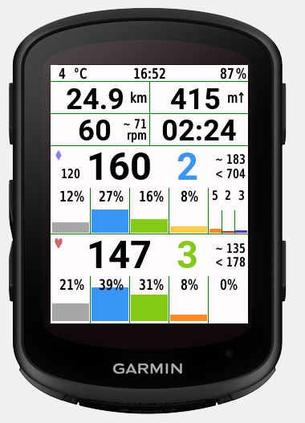

# Garmin-HMsDIY-layouts


External links:
- [HMs DIY #1 - Connect IQ Store - Garmin](https://apps.garmin.com/en-US/apps/b0346b71-bf01-4070-96d6-3de66dcc8233) - there are multiple versions (#1, #2...), so you can have multiple screens of custom data.
- [Official Documentation](http://public.stattegg.info/HMs_DIY_GUIDANCE.pdf)
- [Some more designs on official Github repo](https://github.com/hundsmiachn/Garmin_HMsDIY)


> The screenshots from the designer do not show real form on the device (it is much better).


## b4d-840-hr-cad-pwr (Garmin Edge 540, 840)

> Currently used and updated.




Layout contents (from top to bottom, left to right):
- Temperature in C
- Current time
- Battery level in %
- Distance
- Climbing
- Cadence
- Average cadence
- Timer
- TSS (set up FTP in app settings!)
- 3s power
- Power zone, color coordinated to Garmin colors (set up power zones in app settings!)
- Normalized power without zeroes
- Max power
- Power in zones (in percent and bars)
- Heart rate
- Heart rate zone
- Average heart rate
- Max heart rate
- Heart rate in zones (in percent and bars)

```
C!!iQJ!ww*!O'p$a!!!$d!"6][!WW3zOx,0H!!!!!$V!!iQ)!WW3zOx,0[!!!!!°C!!lCt"TSNyLbRx\!!!!!$H:$M!"4^@!WW3zJ2zLh!!!!!$V!!iQ)!ww*"J2zM"!!!!!%!!iQ*!w@WM!s'8f!!!!g!!iQ*!w@WM$IKiq!!!"b!""dL!WW3zMI@WA!!!!!$V!!iQ)!WW3zJ2'`s!!!!!km!".H4!WW3zLg_Fg!!!!!$V!!iQ)!ww*"J2'b:!!!!!m!!iQ)!ww*"J2'bD!!!!!↑!!iQ*!w@WM!s,q\!!!":!"(bH"98E%J0EFA!!!!!~ $V!"(J8!WW3zLgdr1!!!!!$V!!iQ)!rrw$J0GE$!!!!!rpm!!l\/zQOi)Lgds^!!!!!$H:$M:$C!!iQ*!w@WM!s2UR!!!"b!"Bc"!:9(8JF[+c!!!"8!"BJo!:9(7JF[+S!!!"8!"B2g!:9(6JF[+C!!!"8!"Ao_!:9(5KyU1Y!!!"8!"AWW!:9(4KyU1(!!!"8!"A?O!:9(3KyU0L!!!"8!"A'G!:9(2KyU/p!!!"8!"A5X!rrw$Lbh"a!!!!!$V%!"AMh!rrw$Lbhz=!!!!!$V%!"Afz!rrw$Lbhzo!!!!!$V%!"B)3!rrw$Lbh$J!!!!!$V%!"BAC!WW3zLa+nZ!!!!!$V!"BYS!WW3zLa+nj!!!!!$V!"Bqc!WW3zLa+oy!!!!!$V!!iQ)!Jz_zLb`d/!!!!!♦!zf$C!WW3zOE+H1!!!!!$V-ia6N!5SX8!!!6l!:$3W!!!4b!!(FI!!!2N!!%QL!!!.b!5QCc!!!!"!"xs-!WW30LiQVQ!!!!!$V2uiqn!*V).!!!!g!7Ny5!!!!]!;VHt!!!!S!;ai/!!!!I!.rw6!!!!?!'?P=!!!!5!2cWj!!!!+!"+Ux"98E%J0K[m!!!!!~ $V!"+=.!rrwzJ-(C+!!!!!$V!"xZr!WW3zOwVn5!!!!!$V!"*IS"98E%J0N5`!!!!!< $V!!iQ*!w@WM"u@f?!!!$y!!iQ*!w@WMzt$8.!!!$y!!iQ*!w@WM$r\^r!!!$y!!iQ*!w@WM%q@0a!!!$y!!iQ*!w@WMy9FBI!!!$y!!iQ*!w@WMyTaKZ!!!$y(M@AA!*V).!!!,b!*V).!!!!"(M@A9!7Ny5!!!,b!7Ny5!!!!"(M@A1!;VHt!!!,b!;VHt!!!!"(M@A)!;ai/!!!,b!;ai/!!!!"(M@A!!.rw6!!!,b!.rw6!!!!"(M@@n!'?P=!!!,b!'?P=!!!!"(M@@f!2cWj!!!,b!2cWj!!!!"!!iQ*!w@WM!sB2a!!!$y!"wNq!:/t4K(KoT!!!"8!"w6i!:/t3Kydch!!!"8!";sa!:/t2Kydc7!!!"8!";[Y!:/t1Kydb[!!!"8!";CQ!:/t0Kydb*!!!"8!!iQ)!R,:nLbpAx!!!!!♥!"1S:"98E%J0[E+!!!!!~ $V!"1kJ"98E%J0]go!!!!!< $V!"2.Z!WW3/Lia3`!!!!!$V-ia6V!7Ny5!!!!S!;VHt!!!!I!.rw6!!!!?!'?P=!!!!5!2cWj!!!!+!"1"o!WW3zOE;%@!!!!!$V-ia6F!5SX8!!!6N!:$3W!!!4:!!(FI!!!2y!!%QL!!!.l!5QCc!!!!"!!iQ*!w@WM"uPCN!!!%A!!iQ*!w@WMzt3j=!!!%A!!iQ*!w@WM$rlw,!!!%A!!iQ*!w@WM%qObp!!!%A!"w[W!rrw$Lc"W5!!!!!$V%!"wCG!rrw$Lc"VY!!!!!$V%!"w+7!rrw$Lc"V)!!!!!$V%!";h'!rrw$Lc"UL!!!!!$V%!";Ol!rrw$Lc"Tp!!!!!$V%(LLN!!7Ny5!!!,b!7Ny5!!!!"(LLMn!;VHt!!!,b!;VHt!!!!"(LLMf!.rw6!!!,b!.rw6!!!!"(LLM^!'?P=!!!,b!'?P=!!!!"(LLMV!2cWj!!!,b!2cWj!!!!"
```

## b4d-840-hr-cad (Garmin Edge 540, 840)

> Since I have added power meter to my setup, this layout probably won't get updated. 


```
C!!iQJ!ww*!O'p$a!!!$d!!iQ*!w@WM!s'Dj!!!!h!!iQ*!w@WM!s/cW!!!"N!!iQ*!w@WM!s8-D!!!z4!!iQ*!w@WM$IKiq!!!z4!"6][!WW3zOx,0H!!!!!$V!!iQ)!WW3zOx,0[!!!!!°C!!lCt"TSNyLbRx\!!!!!$H:$M!"4^@!WW3zJ2zLh!!!!!$V!!iQ)!ww*"J2zM"!!!!!%!""dL!WW3zMK(%Y!!!!!$V!!iQ)!WW3zJ0@I_!!!!!km!".H4!WW3zLiFj*!!!!!$V!!iQ)!ww*"J2'V6!!!!!m!!iQ)!ww*"J2'V@!!!!!↑!"(bH!WW3zJ0JCz!!!!!$V!"(J8!WW3zLiP=d!!!!!$V!!iQ)!rrw$J0LYc!!!!!rpm!!l\/zQOi)LiP?w!!!!!$H:$M:$C!!iQ)!R,:nJMSEx!!!!!♥!"1"o!WW3zLiV]n!!!!!$V"2c6q!WW3-:BR[U!"k;c-ia6F!5SX8!!!6l!:$3W!!!4b!!(FI!!!2N!!%QL!!!.D!5QCc!!!!"!"2.Z!WW3zLiV_)!!!!!$V!"1kJz64`(J0Syx!!!!!MAX: $V!"1S:z64`(J0PLK!!!!!AVG: $V!!iQ*!S5iQyqci4!!!z_!!iQ*!w@WM!sI^6!!!$[!!iQ*!w@WM"uPCN!!!%A!!iQ*!w@WMzt3j=!!!%A!!iQ*!w@WM$rlw,!!!%A!!iQ*!w@WM%qObp!!!%A!"wNq!:/t4K(S.!!!!!Z!"w6i!:/t3Kyl"5!!!!Z!";sa!:/t2Kyl!Y!!!!Z!";[Y!:/t1Kyl!(!!!!Z!";CQ!:/t0KykuL!!!!Z!"w[W!rrw$Lc"W5!!!!!$V%!"wCG!rrw$Lc"VY!!!!!$V%!"w+7!rrw$Lc"V)!!!!!$V%!";h'!rrw$Lc"UL!!!!!$V%!";Ol!rrw$Lc"Tp!!!!!$V%(LLN!!5SX8!!!,b!5SX8!!!!"(LLMn!:$3W!!!,b!:$3W!!!!"(LLMf!!(FI!!!,b!!(FI!!!!"(LLM^!!%QL!!!,b!!%QL!!!!"(LLMV!5QCc!!!,b!5QCc!!!!"
```

## b4d-530-hr-cad (Garmin Edge 530, 830)

> Probably the final version.


```
C!!iQJ!ww*!O'p$a!!!$d!!iQ*!w@WM!s'Dj!!!!h!!iQ*!w@WM!s/cW!!!"N!!iQ*!w@WM!s8-D!!!z4!!iQ*!w@WM$IKiq!!!z4!"6][!WW3zOwDb0!!!!!$V!!iQ)!WW3zOwDbC!!!!!°C!!lCt"TSNyL`jpD!!!!!$H:$M!"4^@!WW3zJ0w)P!!!!!$V!!iQ)!ww*"J0w)_!!!!!%!""dL!WW3zMICU@!!!!!$V!!iQ)zQOi)L_1bD!!!!!Distance!!iQ)!WW3zJ.\TV!!!!!km!".H4!WW3zLgbDf!!!!!$V!!iQ)$ig8-L_1cl!!!!!Total Ascent!!iQ)!ww*"J.Zcx!!!!!m!!iQ)!ww*"J2)a'!!!!!↑"1g1z!S5iQzBCA4!!!!X!"(bH!WW3zJ.bPT!!!!!$V!"(J8!WW3zLgjV'!!!!!$V!!iQ)z64`(L_9u-!!!!!Cadence!!iQ)!rrw$J.dg?!!!!!rpm!!l\/"TSNyLgjWT!!!!!$H:$M!!iQ)"TSNyL_:!U!!!!!Timer!"1"o!WW3zLgq!1!!!!!$V!"2.Z!WW3zz\+Fg!!!!!$V!!iQ*!S5iQyqci4!!!z_zD4.5!ww*,:BR[U!"k;c-ia6F!5SX8!!!6l!:$3W!!!4b!!(FI!!!2N!!%QL!!!.D!5QCc!!!!"!!iQ)!rrw$J.i'b!!!!!bpm!!iQ)!R,:nJ3rm.!!!!!♥!"1kJz64`(J.kL"!!!!!MAX: $V!"1S:z64`(J.i57!!!!!AVG: $V!!iQ*!w@WM!sI^6!!!$[!!iQ*!w@WM"uPCN!!!%A!!iQ*!w@WMzt3j=!!!%A!!iQ*!w@WM$rlw,!!!%A!!iQ*!w@WM%qObp!!!%A!"wNq!:/t4K(S.!!!!!Z!"w6i!:/t3Kyl"5!!!!Z!";sa!:/t2Kyl!Y!!!!Z!";[Y!:/t1Kyl!(!!!!Z!";CQ!:/t0KykuL!!!!Z!"w[W!rrw$La;L%!!!!!$V%!"wCG!rrw$La;KI!!!!!$V%!"w+7!rrw$La;Jn!!!!!$V%!";h'!rrw$La;Jw!!!!!$V%!";Ol!rrw$La;I`!!!!!$V%(LLN!!5SX8!!!,b!5SX8!!!!"(LLMn!:$3W!!!,b!:$3W!!!!"(LLMf!!(FI!!!,b!!(FI!!!!"(LLM^!!%QL!!!,b!!%QL!!!!"(LLMV!5QCc!!!,b!5QCc!!!!"
```


